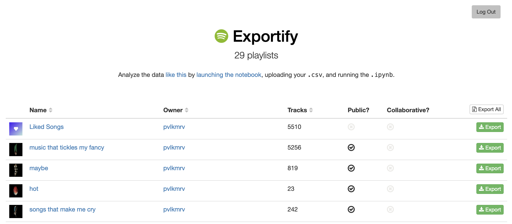

[](https://github.com/pavelkomarov/exportify/actions)
[](https://mybinder.org/v2/gh/pavelkomarov/exportify/master)

Export your Spotify playlist metadata for analysis or just safekeeping: [exportify.net](https://exportify.net)

<a href="https://pavelkomarov.com/exportify"></a>

### Export Format

Playlist data is exported in [CSV](http://en.wikipedia.org/wiki/Comma-separated_values) format with the following fields:

- [Track URI](https://developer.spotify.com/documentation/web-api/concepts/spotify-uris-ids)
- Track Name
- Album Name
- Artist Name(s)
- Release Date
- Duration (ms)
- Popularity
- Explicit
- Added By
- Added At
- Genres
- Record Label
- Danceability
- Energy
- Key
- Loudness
- Mode (Major or Minor)
- Speechiness
- Acousticness
- Instrumentalness
- Liveness
- Valence
- Tempo
- Time Signature

### Analysis

Run the [Jupyter Notebook](https://github.com/pavelkomarov/exportify/blob/master/taste_analysis.ipynb) or [launch it in Binder](https://mybinder.org/v2/gh/pavelkomarov/exportify/master) to get a variety of plots about the music in a playlist including:

- Most common artists
- Most common genres
- Release date distribution
- Popularity distribution
- Your songs' distributions of Acousticness, Valence, etc.
- Time signatures and keys
- All songs plotted in 2D to indicate relative similarities


### Development

Most of the interesting logic that communicates with the Spotify Web API happens in Javascript in `exportify.js`. I've left many detailed code comments and tried to structure it as rationally as I can, so take a look. The webpage skin and a few action bindings are defined in `index.html`.

To experiment with changes, run a local web server. For example, using Python (in the Exportify repo dir):

```bash
python3 -m http.server
```

Then open [http://localhost:8000](http://localhost:8000). The Javascript can be invoked by interacting with this locally-served webpage.

Data science stuff is written with Python in `taste_analysis.ipynb`, which you can run with `python3 -m notebook`, then navigating to [http://localhost:8888](http://localhost:8888).

### Contributing

1. Fork it
2. Create your feature branch (`git checkout -b my-new-feature`)
3. Commit your changes (`git commit -m "message"`)
4. Push to the branch (`git push origin my-new-feature`)
5. Create a new Pull Request
